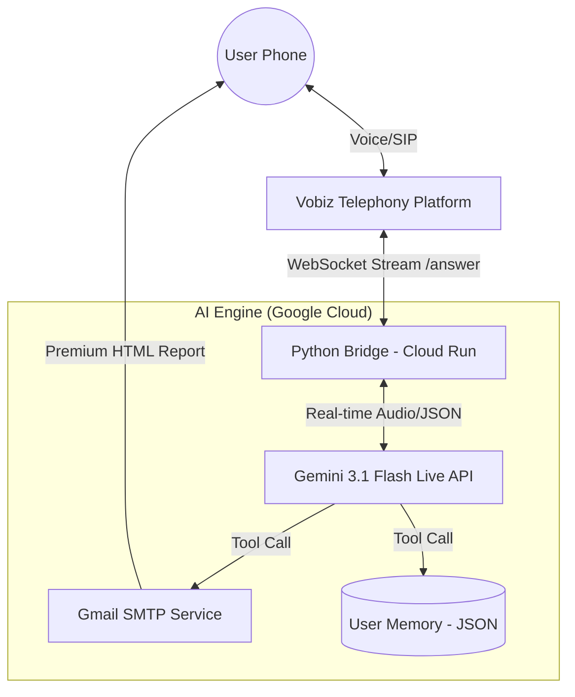

# Jyotish Mitra Voice Agent Architecture

This document outlines the end-to-end architecture of the **Jyotish Mitra** Vedic Astrology Voice Assistant.

## 1. High-Level Workflow
1. **User Call**: The user dials the Vobiz number (`+918065481243`).
2. **Telephony Bridge**: Vobiz sends an HTTP POST to our **Cloud Run** instance.
3. **Audio Streaming**: Our server returns an XML response that establishes a bidirectional WebSocket stream between Vobiz and our Python bridge.
4. **AI Processing**: The bridge connects to **Gemini 2.0/3.1 Multimodal Live API**, streaming the user's voice in real-time.
5. **Logic & Persona**: Gemini uses the **Jyotish Vedic Persona** to guide the user through birth details and rectification.
6. **Persistence**: The agent recognizes returning callers by their ID using a local memory system.
7. **Delivery**: Upon completion, the agent triggers a tool to send a high-premium HTML report via **Gmail SMTP**.

---

## 2. Component Diagram

---

## 3. Technology Stack

### **Telephony & Streaming**
- **Vobiz**: Provides the virtual number and the `<Stream>` XML protocol for real-time audio.
- **Audio Codec**: G.711 mu-law (8kHz) for telephony compatibility.

### **Backend (The Bridge)**
- **Language**: Python 3.11
- **Framework**: `aiohttp` for high-performance asynchronous WebSockets.
- **Resampling**: `audioop` is used to convert telephony audio (8kHz) to Gemini-ready audio (16kHz/24kHz).
- **Deployment**: Google Cloud Run (Containerized via Docker).

### **AI Core**
- **Model**: `gemini-3.1-flash-live-preview` (Multimodal Live).
- **Features**: 
  - **Low Latency**: Sub-second voice-to-voice response.
  - **Barge-in**: Users can interrupt the AI naturally.
  - **Tool Calling**: Native support for triggering Python functions (Email/Storage).

---

## 4. Key Logic Modules

### **A. Audio Resampling Pipeline**
- **Telephony -> AI**: 8kHz mu-law -> 8kHz Linear PCM -> 16kHz Linear PCM.
- **AI -> Telephony**: 24kHz Linear PCM -> 8kHz Linear PCM -> 8kHz mu-law.

### **B. Memory & Personalization**
- **Caller Recognition**: Indexed by `caller_id` (phone number).
- **Memory File**: `user_memory.json` stores name, birth details, and email.
- **Context Injection**: Returning users receive a tailored greeting based on their stored profile.

### **C. Notification Engine**
- **Design**: Premium Dark/Gold HTML CSS template.
- **Content**: Dynamic generation of birth details, Vedic analysis, and a full conversation transcript.

---

## 5. Deployment & Security
- **CI/CD**: GitHub Actions automates the build and deploy to Google Cloud Artifact Registry and Cloud Run.
- **Secrets**: API keys and Gmail credentials are managed securely via GitHub Secrets and injected as Environment Variables.
- **Timeout**: Configured for 3600s (1 hour) to handle deep spiritual consultations without disconnection.
